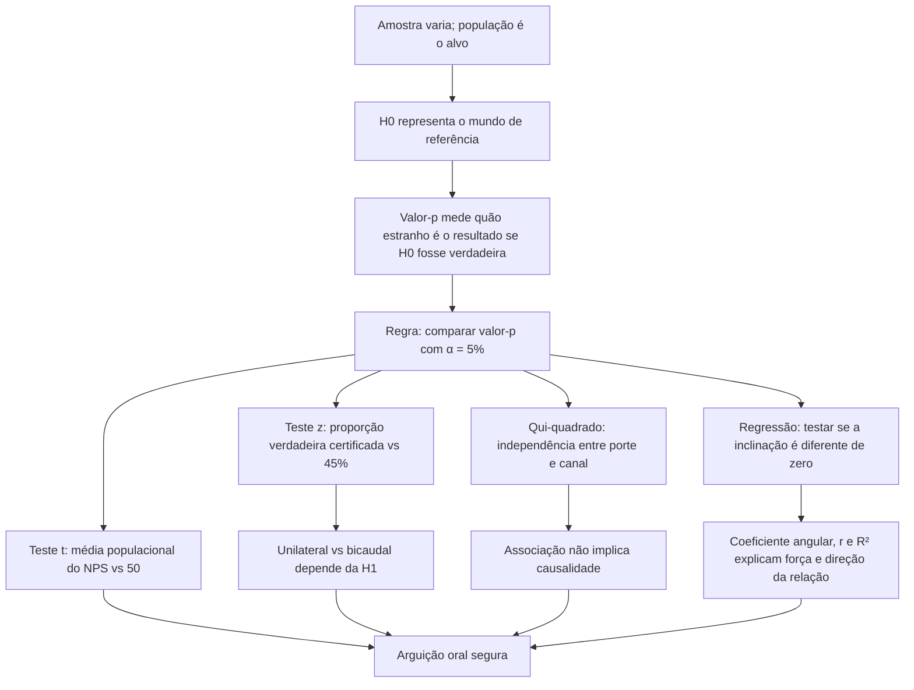

> [!quote] YOU

> [!note] SKILL loaded: teach

Quero que você seja meu professor particular de Estatística II e me prepare para a arguição oral da 1ª Atividade Monitorada da FGV. Assuma que eu sei pouco e ensine do zero, com linguagem simples, fórmulas em texto comum e exemplos de negócio.

CONTEXTO DA ATIVIDADE

O trabalho analisa uma base de 240 corretoras da Atlântica Seguros. O nível de significância usado é α = 5%.

As quatro análises são:

1. Teste t para uma média:
Verificar se o NPS médio da rede difere de 50.

2. Teste para uma proporção:
Verificar se a proporção de corretoras certificadas está abaixo da meta de 45%. Também preciso entender o que mudaria em um teste bicaudal.

3. Teste qui-quadrado de independência:
Verificar se o canal de atendimento — Digital, Híbrido ou Presencial — está associado ao porte da corretora — Pequena, Média ou Grande.

4. Regressão linear simples:
Explicar o NPS, variável Y, usando a taxa de renovação, variável X. Preciso entender a equação da reta, coeficiente angular, intercepto, teste t/F, valor-p, correlação e R².

RESULTADOS CORRETOS PARA VOCÊ USAR COMO GABARITO INTERNO

Análise 1:
- n = 240
- Média do NPS = 45,696
- Desvio-padrão = 18,743
- Erro-padrão = 1,210
- t = -3,558
- Graus de liberdade = 239
- Valor-p bicaudal = 0,00045
- IC 95% = 43,31 até 48,08
- Conclusão: rejeitar H0; o NPS médio difere de 50 e está abaixo do patamar de referência.

Análise 2:
- Certificadas = 106 de 240
- Proporção amostral = 44,17%
- z = -0,259
- Valor-p unilateral aproximado = 0,398
- Valor-p bicaudal aproximado = 0,795
- Conclusão: não rejeitar H0; apesar de 44,17% ser numericamente inferior a 45%, não existe evidência estatística suficiente de que a proporção verdadeira esteja abaixo da meta.

Análise 3:
Tabela observada:
- Grandes: 41 Digital, 24 Híbrido, 15 Presencial
- Médias: 22 Digital, 35 Híbrido, 23 Presencial
- Pequenas: 15 Digital, 15 Híbrido, 50 Presencial

Resultados:
- Qui-quadrado = 44,990
- Graus de liberdade = 4
- Valor-p ≈ 0,000000004
- V de Cramér = 0,306
- Conclusão: rejeitar H0; existe associação entre porte e canal.
- Padrão: grandes são mais digitais, médias mais híbridas e pequenas mais presenciais.

Análise 4:
- Equação: NPS previsto = -86,856 + 1,686 × taxa de renovação
- Correlação r = 0,854
- R² = 72,88%
- t do coeficiente angular = 25,289
- F = 639,528
- Graus de liberdade do F = 1 e 238
- Valor-p ≈ 2,22 × 10^-69
- Conclusão: a taxa de renovação tem relação linear positiva, forte e estatisticamente significativa com o NPS. Cada aumento de 1 ponto percentual na renovação está associado a aproximadamente 1,69 ponto adicional de NPS. Associação não prova causalidade.

> [!question] Quiz
> Antes de montar o plano, vou localizar seu ponto de partida. Em um teste de hipótese, o que o valor-p mede?
>
> 1. A chance de H0 ser verdadeira depois de ver a amostra
> 2. A chance de rejeitar H0 quando H0 é verdadeira
> 3. A chance de a média amostral ser igual à média populacional
> 4. A chance de observar um resultado tão extremo quanto o da amostra se H0 fosse verdadeira

> [!failure] Quiz — incorrect ✗
> Your answer: 2. A chance de rejeitar H0 quando H0 é verdadeira
> Correct answer: 4
>
> O valor-p é calculado assumindo H0 como verdadeira. Ele pergunta: “se H0 fosse verdade, quão raro seria ver uma estatística tão extrema quanto a observada?” Ele não é a probabilidade de H0 ser verdadeira. A chance de rejeitar H0 quando H0 é verdadeira é o nível de significância α, não o valor-p.

> [!question] Quiz
> Se α = 5% e o valor-p de um teste é 0,398, qual decisão estatística correta tomamos?
>
> 1. Rejeitar H0
> 2. Aumentar α automaticamente
> 3. Não rejeitar H0
> 4. Aceitar H1 como verdadeira

> [!success] Quiz — correct ✓
> Your answer: 3. Não rejeitar H0
> Correct answer: 3
>
> A regra operacional é: se valor-p ≤ α, rejeitamos H0; se valor-p > α, não rejeitamos H0. Como 0,398 é muito maior que 0,05, não rejeitamos H0. Isso não prova que H0 seja verdadeira; só diz que a amostra não trouxe evidência suficiente contra H0.

> [!question] Quiz
> No teste t para uma média, quando comparamos o NPS médio da amostra com 50, o que fica no centro da hipótese nula H0?
>
> 1. A média populacional do NPS é 50
> 2. O erro-padrão do NPS é 50
> 3. A média amostral do NPS é 50
> 4. O desvio-padrão amostral é 50

> [!failure] Quiz — incorrect ✗
> Your answer: 3. A média amostral do NPS é 50
> Correct answer: 1
>
> H0 fala sobre o parâmetro da população, não sobre o número observado na amostra. Aqui o parâmetro é a média verdadeira da rede, μ. A amostra deu média 45,696, mas o teste pergunta se essa diferença em relação a 50 é grande demais para ser explicada por variação amostral.

> [!question] Quiz
> Qual frase separa corretamente amostra e população no caso das 240 corretoras?
>
> 1. A amostra é sempre desconhecida; a população é sempre calculada exatamente
> 2. A amostra é o conjunto observado; a população é o alvo sobre o qual queremos concluir
> 3. A amostra e a população são sempre o mesmo conjunto
> 4. A amostra é o alvo completo; a população é o subconjunto observado

> [!success] Quiz — correct ✓
> Your answer: 2. A amostra é o conjunto observado; a população é o alvo sobre o qual queremos concluir
> Correct answer: 2
>
> A amostra é o que foi observado: aqui, as 240 corretoras da base. A população é o universo conceitual sobre o qual queremos inferir, como a rede/realidade verdadeira das corretoras da Atlântica Seguros. Testes estatísticos existem justamente porque usamos a amostra para tirar conclusões sobre parâmetros populacionais.

> [!question] Quiz
> Na análise das corretoras certificadas, “verificar se a proporção está abaixo da meta de 45%” pede qual hipótese alternativa?
>
> 1. p ≠ 0,45
> 2. p < 0,45
> 3. p = 0,4417
> 4. p > 0,45

> [!success] Quiz — correct ✓
> Your answer: 2. p < 0,45
> Correct answer: 2
>
> A palavra “abaixo” define uma alternativa unilateral à esquerda: H1: p < 0,45. Um teste bicaudal seria H1: p ≠ 0,45, isto é, interessado em qualquer diferença, tanto abaixo quanto acima da meta.

> [!question] Quiz
> Se o teste unilateral à esquerda da proporção deu z = -0,259 e valor-p ≈ 0,398, o que muda no teste bicaudal, mantendo a mesma amostra?
>
> 1. O valor-p fica aproximadamente 0,199
> 2. O z vira necessariamente positivo
> 3. O valor-p fica aproximadamente 0,795
> 4. A proporção amostral vira 45%

> [!failure] Quiz — incorrect ✗
> Your answer: 1. O valor-p fica aproximadamente 0,199
> Correct answer: 3
>
> Com z negativo, o teste unilateral à esquerda olha só a cauda esquerda: cerca de 0,398. O bicaudal olha desvios para os dois lados, então dobra a cauda extrema correspondente: aproximadamente 2 × 0,398 = 0,796, arredondado para 0,795. A amostra e o z observado não mudam; muda a pergunta feita pelo teste.

> [!question] Quiz
> No teste qui-quadrado de independência entre porte e canal, o que a hipótese nula H0 afirma?
>
> 1. Grandes corretoras usam mais o canal digital
> 2. Todos os canais têm a mesma frequência observada
> 3. Porte e canal têm médias iguais
> 4. Porte e canal não estão associados

> [!success] Quiz — correct ✓
> Your answer: 4. Porte e canal não estão associados
> Correct answer: 4
>
> No qui-quadrado de independência, H0 diz que as duas variáveis categóricas são independentes: conhecer o porte não muda a distribuição esperada do canal. H1 diz que existe associação: a distribuição de canais muda conforme o porte.

> [!question] Quiz
> Na tabela 3 × 3 de porte por canal, quais são os graus de liberdade do teste qui-quadrado de independência?
>
> 1. 6
> 2. 8
> 3. 4
> 4. 9

> [!success] Quiz — correct ✓
> Your answer: 3. 4
> Correct answer: 3
>
> Para uma tabela com r linhas e c colunas, os graus de liberdade são (r - 1)(c - 1). Aqui são 3 portes e 3 canais, então (3 - 1)(3 - 1) = 2 × 2 = 4.

> [!question] Quiz
> Na regressão NPS previsto = -86,856 + 1,686 × taxa de renovação, o que significa o coeficiente 1,686?
>
> 1. Cada 1 ponto percentual a mais na renovação se associa a 1,686 ponto a mais no NPS previsto
> 2. A regressão explica exatamente 1,686% da variação do NPS
> 3. A correlação entre renovação e NPS é 1,686
> 4. Quando a renovação sobe 1%, o NPS necessariamente sobe 86,856 pontos

> [!failure] Quiz — incorrect ✗
> Your answer: 3. A correlação entre renovação e NPS é 1,686
> Correct answer: 1
>
> O coeficiente angular diz quanto o Y previsto muda quando X aumenta uma unidade. Aqui, se a taxa de renovação está em pontos percentuais, +1 ponto percentual em renovação está associado a +1,686 ponto no NPS previsto. É associação estatística, não prova automática de causalidade.

> [!question] Quiz
> Se a correlação entre renovação e NPS é r = 0,854 e R² = 72,88%, qual interpretação está correta?
>
> 1. A regressão linear explica cerca de 72,88% da variação observada do NPS
> 2. O NPS aumenta 72,88 pontos quando a renovação aumenta 1 ponto
> 3. A correlação é fraca porque está abaixo de 1
> 4. A taxa de renovação causa exatamente 72,88% do NPS de cada corretora

> [!question] Quiz — I don't know
> Your answer: I don't know
> Correct answer: 1
>
> R² é a fração da variação de Y que é explicada pelo modelo linear com X. Aqui, o modelo com taxa de renovação explica cerca de 72,88% da variação observada do NPS. Isso não é causalidade individual, nem é o coeficiente angular. Como r = 0,854, a associação linear é forte e positiva.

> [!question] Question
> Para a arguição oral, você quer que eu prepare você em qual formato principal?
>
> 1. Explicação do zero + simulado de perguntas da banca (Recomendado)
> 2. Só explicação do zero
> 3. Só treino de arguição

> [!example] Answer
> 1. Explicação do zero + simulado de perguntas da banca (Recomendado)

> [!abstract] PI

Perfeito. Já mapeei seu ponto de partida:

- Você sabe aplicar a regra “valor-p < α rejeita H0”.
- Você distingue amostra e população quando perguntado diretamente.
- Você já pegou bem a ideia de hipótese unilateral “abaixo”.
- Você sabe a H0 do qui-quadrado de independência e os graus de liberdade da tabela 3×3.
- Seus pontos frágeis agora são:
  - o significado exato de valor-p;
  - diferença entre parâmetro populacional e estatística amostral dentro da H0;
  - diferença entre teste unilateral e bicaudal;
  - interpretação de coeficiente angular, correlação e R² na regressão.

Vou esperar uma checagem rápida de conteúdo para montar o plano da aula com segurança. Depois te apresento:

1. a ordem de estudo;
2. o mapa de dependências;
3. e só começo a ensinar quando você aprovar o plano.

> [!abstract] PI

Ótimo. Com base no seu diagnóstico, vou te preparar assim:

## Plano da preparação

Vamos começar pelo **motor comum dos testes estatísticos**: hipótese nula, hipótese alternativa, valor-p e decisão com α = 5%. Esse é o alicerce que sustenta as três primeiras análises e também aparece na regressão.

Depois vamos aplicar esse motor, em ordem:

1. **Teste t para média**  
   Entender por que a pergunta é sobre a média populacional do NPS, não só sobre a média da amostra.

2. **Teste z para proporção**  
   Entender por que “abaixo de 45%” é unilateral e o que muda se for bicaudal.

3. **Qui-quadrado de independência**  
   Entender associação entre duas variáveis categóricas: porte e canal.

4. **Regressão linear simples**  
   Entender reta, intercepto, coeficiente angular, teste da inclinação, correlação e R².

Depois disso fazemos o **simulado oral**, com perguntas prováveis da banca e respostas curtas.

## Mapa de dependências

A ideia é: primeiro você entende **o mecanismo geral de decisão estatística**; depois cada análise vira só uma aplicação diferente desse mesmo mecanismo.

Se esse plano estiver ok, eu começo pela primeira base: **o que são H0, H1, valor-p e α**, usando exemplos da Atlântica Seguros.

> [!quote] YOU

ok

> [!abstract] PI

Perfeito. Vamos construir do zero.

## Nó 1 — Amostra varia; população é o alvo

### 1. Motivo

A Atlântica tem uma base com **240 corretoras**. A pergunta da arguição não é só:

> “O que aconteceu nessas 240 corretoras?”

A pergunta estatística é mais ambiciosa:

> “O que esses dados sugerem sobre a realidade da rede da Atlântica?”

Essa diferença é o coração da estatística.

---

### 2. Verdade fundamental

**Amostra é o que eu observei. População é o alvo sobre o qual eu quero concluir.**

No seu trabalho:

- **Amostra:** as 240 corretoras analisadas.
- **População/alvo:** a rede ou realidade mais ampla das corretoras da Atlântica Seguros.

A média amostral do NPS foi:

> 45,696

Mas o teste não quer saber apenas se **essa amostra** deu 45,696. Isso já sabemos.

Ele quer saber:

> será que a **média verdadeira da rede** pode ser 50, e essa amostra só saiu um pouco abaixo por acaso?

---

### 3. Conexão

Essa distinção explica por que as hipóteses usam letras como:

- média populacional: μ
- proporção populacional: p
- inclinação populacional da regressão: β₁

E não apenas os números observados na amostra.

Exemplo:

No teste t, a hipótese nula é:

> H0: μ = 50

Não é:

> H0: média amostral = 50

Porque a média amostral já veio 45,696. O que está em dúvida é a **média verdadeira da população**.

Frase oral segura:

> “A amostra apresentou NPS médio de 45,696, mas o teste avalia se há evidência suficiente para concluir que a média populacional difere de 50.”

Agora vamos confirmar se esse primeiro nó ficou sólido.

> [!quote] YOU

ok entendi

> [!question] Quiz
> No teste t do NPS, por que H0 é μ = 50, e não média amostral = 50?
>
> 1. Porque H0 fala do parâmetro populacional, não do valor observado na amostra
> 2. Porque μ representa o desvio-padrão da amostra, não a média
> 3. Porque a média amostral sempre precisa ser igual ao valor de referência
> 4. Porque H0 deve sempre usar o menor valor disponível nos dados

> [!success] Quiz — correct ✓
> Your answer: 1. Porque H0 fala do parâmetro populacional, não do valor observado na amostra
> Correct answer: 1
>
> H0 é uma afirmação sobre o parâmetro populacional: aqui, a média verdadeira μ da rede. A média amostral já foi observada e vale 45,696; ela é usada como evidência para avaliar se μ = 50 continua plausível.

> [!abstract] PI

Boa. Esse nó está sólido.

## Nó 2 — H0 é o “mundo de referência”

### 1. Motivo

Agora vem a pergunta natural:

> Como decidir se 45,696 é “suficientemente diferente” de 50?

Porque só olhar a diferença bruta não basta.

Diferença observada:

> 45,696 - 50 = -4,304

Mas essa diferença pode ser:

- uma oscilação normal da amostra;
- ou evidência real de que o NPS médio da rede está abaixo de 50.

Para separar essas duas possibilidades, criamos um mundo hipotético.

---

### 2. Verdade fundamental

**A hipótese nula H0 é o mundo de referência que fingimos ser verdadeiro para medir se a amostra ficou estranha demais.**

No teste do NPS:

> H0: μ = 50

Tradução:

> “Vamos supor que a média verdadeira da rede seja 50.”

Aí perguntamos:

> Se μ fosse mesmo 50, seria comum observar uma média amostral tão baixa quanto 45,696?

Se fosse comum, não rejeitamos H0.  
Se fosse raro demais, rejeitamos H0.

---

### 3. Conexão

Esse é o caminho para o valor-p.

A lógica é:

1. Assumo H0 como referência.
2. Vejo o resultado da amostra.
3. Meço quão estranho esse resultado seria nesse mundo.
4. Se for estranho demais, rejeito H0.

No seu caso:

- média de referência: 50
- média observada: 45,696
- erro-padrão: 1,210
- estatística t: -3,558
- valor-p: 0,00045

A estatística t = -3,558 quer dizer, em linguagem simples:

> A média observada ficou 3,558 erros-padrão abaixo do valor esperado sob H0.

Isso é bem longe. Por isso o valor-p é pequeno.

Frase oral segura:

> “A hipótese nula funciona como referência: eu assumo μ = 50 e verifico se a média amostral observada seria plausível nesse cenário.”

Agora fixa isso.

> [!quote] YOU

como a gnt chega no valorp, erropadr e estat t?

> [!abstract] PI

Ótima pergunta. Esse é o núcleo do teste t.

Queremos responder:

> Se a média verdadeira fosse 50, quão longe a média observada 45,696 ficou?

Para isso precisamos de 3 peças:

1. **erro-padrão**
2. **estatística t**
3. **valor-p**

---

## 1. Erro-padrão

A amostra tem desvio-padrão:

> s = 18,743

Esse número mede a dispersão dos NPS individuais das corretoras.

Mas a pergunta do teste não é:

> “quanto varia o NPS de uma corretora para outra?”

A pergunta é:

> “quanto a média amostral costuma variar de uma amostra para outra?”

Essa variação da média chama **erro-padrão**.

Fórmula:

> erro-padrão = desvio-padrão / raiz de n

No seu caso:

> erro-padrão = 18,743 / raiz de 240

Como raiz de 240 ≈ 15,492:

> erro-padrão ≈ 18,743 / 15,492  
> erro-padrão ≈ 1,210

Interpretação oral:

> “O erro-padrão mostra a variação esperada da média amostral. Como temos 240 observações, a média fica bem mais estável do que os dados individuais.”

---

## 2. Estatística t

Agora comparamos a média observada com a média de referência.

Média observada:

> 45,696

Média de referência sob H0:

> 50

Diferença:

> 45,696 - 50 = -4,304

Mas uma diferença de -4,304 é grande ou pequena?

Depende do erro-padrão.

Por isso padronizamos:

> t = diferença / erro-padrão

Então:

> t = (45,696 - 50) / 1,210  
> t = -4,304 / 1,210  
> t ≈ -3,558

Interpretação oral:

> “A média amostral ficou cerca de 3,56 erros-padrão abaixo do valor 50.”

O sinal negativo só indica direção:

> a amostra ficou abaixo de 50.

---

## 3. Valor-p

Agora vem a ideia mais importante.

O valor-p pergunta:

> Se H0 fosse verdadeira, ou seja, se a média real fosse 50, qual seria a chance de observar uma diferença tão extrema quanto essa?

Como o teste é bicaudal, porque a pergunta é “difere de 50”, olhamos os dois lados:

- muito abaixo de 50;
- ou muito acima de 50.

Com:

> t = -3,558  
> gl = 239

A tabela/software da distribuição t dá:

> valor-p bicaudal = 0,00045

Interpretação:

> “Se a média verdadeira fosse 50, a chance de observar uma média tão distante de 50 quanto essa seria de aproximadamente 0,045%.”

Como:

> 0,00045 < 0,05

Rejeitamos H0.

---

## Resumo em cadeia

A lógica é:

> dispersão dos dados → erro-padrão → estatística t → valor-p → decisão

Com seus números:

> s = 18,743  
> n = 240  
> erro-padrão = 18,743 / raiz(240) = 1,210  
> t = (45,696 - 50) / 1,210 = -3,558  
> valor-p = 0,00045  
> decisão: rejeitar H0

Frase perfeita para arguição:

> “Primeiro calculamos o erro-padrão dividindo o desvio-padrão pela raiz do tamanho da amostra. Depois calculamos a estatística t, que mede quantos erros-padrão a média observada está distante de 50. Como t = -3,558 gerou valor-p bicaudal de 0,00045, menor que 5%, rejeitamos H0 e concluímos que o NPS médio difere de 50, estando abaixo do patamar de referência.”

> [!quote] YOU

ok

> [!question] Quiz
> No teste t do NPS, qual é a interpretação correta de t = -3,558?
>
> 1. A média amostral ficou 3,558 erros-padrão abaixo de 50
> 2. O NPS médio ficou 3,558 pontos percentuais abaixo de 50
> 3. O desvio-padrão da amostra é 3,558
> 4. A chance de H0 ser verdadeira é 3,558%

> [!success] Quiz — correct ✓
> Your answer: 1. A média amostral ficou 3,558 erros-padrão abaixo de 50
> Correct answer: 1
>
> A estatística t padroniza a diferença entre média observada e média hipotética usando o erro-padrão. Como t é negativo, a média observada está abaixo de 50; como o módulo é 3,558, ela está 3,558 erros-padrão distante do valor de referência.

> [!abstract] PI

Boa. Isso está entendido.

Próximo nó: **valor-p e decisão**.

## Nó 3 — Valor-p não é “chance de H0 ser verdadeira”

### 1. Motivo

Na arguição, uma pergunta muito provável é:

> “O que significa esse valor-p de 0,00045?”

Aqui muita gente erra dizendo:

> “Há 0,045% de chance de H0 ser verdadeira.”

Isso está errado.

---

### 2. Ideia correta

O valor-p sempre começa com uma suposição:

> “Supondo que H0 seja verdadeira...”

No teste do NPS:

> “Supondo que a média verdadeira fosse 50...”

Aí o valor-p pergunta:

> “Qual seria a chance de observar um resultado tão extremo quanto o que observei?”

No seu caso:

> valor-p = 0,00045

Tradução:

> “Se o NPS médio verdadeiro fosse 50, seria muito raro observar uma média amostral tão distante de 50 quanto 45,696.”

Mais precisamente:

> “A probabilidade seria aproximadamente 0,045%.”

---

### 3. Decisão com α = 5%

O nível de significância é:

> α = 0,05

Regra:

> se valor-p < α, rejeito H0.

Aqui:

> 0,00045 < 0,05

Então:

> rejeitamos H0.

Conclusão no contexto:

> “Há evidência estatística de que o NPS médio da rede difere de 50. Como a média amostral foi 45,696, a evidência aponta que ele está abaixo do patamar de referência.”

Resposta oral curta:

> “O valor-p de 0,00045 indica que, se a média verdadeira fosse 50, seria extremamente improvável observar uma média tão distante quanto a obtida. Como esse valor-p é menor que 5%, rejeitamos H0.”

Isso fecha a primeira análise.

> [!quote] YOU

ok

> [!question] Quiz
> Se a banca perguntar “o que significa valor-p = 0,00045 no teste do NPS?”, qual resposta é correta?
>
> 1. O erro-padrão do teste é igual a 0,00045
> 2. Existe 0,045% de chance de a hipótese nula ser verdadeira
> 3. Existe 0,045% de chance de a média amostral ser exatamente 50
> 4. Se μ fosse 50, seria muito raro observar uma média tão extrema quanto a obtida

> [!success] Quiz — correct ✓
> Your answer: 4. Se μ fosse 50, seria muito raro observar uma média tão extrema quanto a obtida
> Correct answer: 4
>
> O valor-p é calculado condicionando em H0: ele mede quão raro seria obter um resultado tão extremo quanto o observado se μ = 50 fosse verdade. Ele não dá a probabilidade de H0 ser verdadeira.

> [!abstract] PI

Ótimo. Vamos para a **Análise 2: teste para uma proporção**.

## Nó 4 — Proporção é média de “sim/não”

### 1. Motivo

Agora a pergunta não é sobre NPS médio. É sobre certificação:

> “A proporção de corretoras certificadas está abaixo da meta de 45%?”

Aqui cada corretora só pode entrar como:

- certificada: sim;
- não certificada: não.

Então não estamos testando uma média quantitativa como NPS. Estamos testando uma **proporção**.

---

### 2. Verdade fundamental

**Uma proporção é a fração de casos com uma característica.**

No seu caso:

> 106 certificadas em 240 corretoras

Então:

> proporção amostral = 106 / 240 = 0,4417

Em porcentagem:

> 44,17%

A meta é:

> 45% = 0,45

Então, numericamente, a amostra ficou abaixo da meta:

> 44,17% < 45%

Mas a pergunta estatística é:

> essa diferença é grande o suficiente para concluir que a proporção verdadeira está abaixo de 45%?

---

### 3. Hipóteses

Como o enunciado diz **“abaixo da meta”**, a hipótese alternativa é unilateral à esquerda:

> H0: p = 0,45  
> H1: p < 0,45

Onde:

- p é a proporção verdadeira de corretoras certificadas na população/rede;
- 0,45 é a meta.

Atenção: H0 fala da proporção populacional, não da proporção amostral.

---

### 4. Estatística z

A lógica é igual ao teste t:

> estatística = distância entre observado e referência / erro-padrão

Aqui:

> z = -0,259

Interpretação:

> “A proporção amostral ficou apenas 0,259 erro-padrão abaixo da meta de 45%.”

Isso é muito pouco. Está praticamente colado na meta.

Por isso o valor-p unilateral é alto:

> valor-p ≈ 0,398

---

### 5. Decisão

Com α = 5%:

> 0,398 > 0,05

Então:

> não rejeitamos H0.

Conclusão oral:

> “Embora a proporção amostral de certificadas seja 44,17%, ligeiramente abaixo da meta de 45%, essa diferença é muito pequena em termos estatísticos. Como o valor-p unilateral é 0,398, maior que 5%, não há evidência suficiente para concluir que a proporção verdadeira esteja abaixo da meta.”

Essa frase é excelente para a banca.

> [!quote] YOU

como chegou no p unilateral e no zscore?

> [!abstract] PI

Boa. É exatamente o mesmo raciocínio do teste t, só trocando “média” por “proporção”.

Queremos testar:

> H0: p = 0,45  
> H1: p < 0,45

Ou seja:

> “A proporção verdadeira de certificadas está abaixo de 45%?”

---

## 1. Primeiro: proporção amostral

Temos:

> 106 certificadas em 240 corretoras

Então:

> p̂ = 106 / 240  
> p̂ = 0,4417

Em porcentagem:

> 44,17%

A diferença em relação à meta é:

> 0,4417 - 0,45 = -0,0083

Ou seja, a amostra ficou **0,83 ponto percentual abaixo** da meta.

Mas precisamos saber se isso é muito ou pouco.

---

## 2. Erro-padrão da proporção

No teste de hipótese para proporção, o erro-padrão é calculado usando a proporção da H0, não a proporção amostral.

Fórmula:

> erro-padrão = raiz de [p0 × (1 - p0) / n]

Aqui:

> p0 = 0,45  
> n = 240

Então:

> erro-padrão = raiz de [0,45 × 0,55 / 240]

Calculando:

> 0,45 × 0,55 = 0,2475

> 0,2475 / 240 = 0,00103125

> raiz de 0,00103125 ≈ 0,0321

Então:

> erro-padrão ≈ 0,0321

Interpretação:

> “Se a proporção verdadeira fosse 45%, seria normal a proporção amostral variar em torno de 0,032, ou 3,21 pontos percentuais.”

---

## 3. Estatística z

Agora padronizamos a diferença:

> z = (proporção amostral - proporção da H0) / erro-padrão

Então:

> z = (0,4417 - 0,45) / 0,0321

> z = -0,0083 / 0,0321

> z ≈ -0,259

Interpretação:

> “A proporção amostral ficou só 0,259 erro-padrão abaixo da meta.”

Isso é muito perto de zero. Logo, a amostra quase não se afastou da meta.

---

## 4. Valor-p unilateral

Como a hipótese alternativa é:

> H1: p < 0,45

o teste é **unilateral à esquerda**.

Então o valor-p pergunta:

> “Se a proporção verdadeira fosse 45%, qual a chance de observar uma proporção amostral tão baixa quanto 44,17% ou ainda menor?”

Em termos do z:

> valor-p = P(Z ≤ -0,259)

Consultando tabela normal ou software:

> P(Z ≤ -0,259) ≈ 0,398

Então:

> valor-p unilateral ≈ 0,398

Interpretação simples:

> “Se a proporção verdadeira fosse mesmo 45%, haveria cerca de 39,8% de chance de obter uma amostra tão baixa quanto essa ou menor.”

Isso não é raro. Portanto, não é evidência forte contra H0.

---

## 5. Por que não rejeita?

Com α = 5%:

> valor-p = 0,398  
> α = 0,05

Como:

> 0,398 > 0,05

decisão:

> não rejeitar H0.

Conclusão:

> “Apesar de a amostra estar numericamente abaixo da meta, a diferença é pequena demais para concluir estatisticamente que a proporção verdadeira esteja abaixo de 45%.”

Frase oral boa:

> “O z de -0,259 mostra que a proporção amostral está apenas 0,259 erro-padrão abaixo da meta. Como a cauda esquerda associada a esse z é 0,398, maior que 5%, não rejeitamos H0.”

> [!quote] YOU

ok

> [!question] Quiz
> No teste da proporção certificada, o que significa z = -0,259?
>
> 1. O número de certificadas ficou 0,259 abaixo de 106
> 2. A probabilidade de H0 ser verdadeira é 25,9%
> 3. A proporção amostral ficou 25,9 pontos percentuais abaixo de 45%
> 4. A proporção amostral ficou 0,259 erro-padrão abaixo de 45%

> [!success] Quiz — correct ✓
> Your answer: 4. A proporção amostral ficou 0,259 erro-padrão abaixo de 45%
> Correct answer: 4
>
> O z padroniza a diferença entre a proporção amostral e a proporção de referência usando o erro-padrão. Como z = -0,259, a amostra ficou abaixo da meta, mas só 0,259 erro-padrão abaixo — uma distância muito pequena.

> [!abstract] PI

Boa.

Agora vamos fechar a parte que a banca pode perguntar: **o que mudaria no teste bicaudal?**

## Nó 5 — Unilateral vs bicaudal

### 1. Motivo

O seu enunciado original pergunta:

> “A proporção está abaixo da meta de 45%?”

A palavra **abaixo** já define uma direção.

Mas a banca pode perguntar:

> “E se o teste fosse bicaudal?”

Aí a pergunta mudaria.

---

## 2. Teste unilateral

No seu teste atual:

> H0: p = 0,45  
> H1: p < 0,45

A hipótese alternativa só se importa com um lado:

> abaixo de 45%.

Por isso o valor-p olha só a cauda esquerda.

Como:

> z = -0,259

O valor-p unilateral é:

> P(Z ≤ -0,259) ≈ 0,398

---

## 3. Teste bicaudal

No teste bicaudal, a pergunta seria:

> “A proporção verdadeira é diferente de 45%?”

Não importa se é abaixo ou acima.

As hipóteses seriam:

> H0: p = 0,45  
> H1: p ≠ 0,45

Agora o teste olha os dois lados:

- proporção muito abaixo de 45%;
- proporção muito acima de 45%.

Por isso, com o mesmo z = -0,259, o valor-p bicaudal fica aproximadamente:

> 2 × 0,398 = 0,796

No seu gabarito:

> valor-p bicaudal ≈ 0,795

---

## 4. O que muda e o que não muda?

Não muda:

- n = 240;
- certificadas = 106;
- proporção amostral = 44,17%;
- z = -0,259.

Muda:

- a hipótese alternativa;
- a cauda considerada;
- o valor-p.

Resumo:

> unilateral: H1: p < 0,45 → valor-p ≈ 0,398  
> bicaudal: H1: p ≠ 0,45 → valor-p ≈ 0,795

Nos dois casos:

> valor-p > 0,05

Então a decisão continua:

> não rejeitar H0.

Frase oral segura:

> “No teste bicaudal, a hipótese alternativa deixaria de ser p < 0,45 e passaria a ser p ≠ 0,45. O z observado continuaria -0,259, mas o valor-p passaria a considerar as duas caudas, ficando aproximadamente 0,795. A conclusão continuaria sendo não rejeitar H0.”

> [!quote] YOU

ok

> [!question] Quiz
> Se a banca perguntar “o que mudaria se o teste da proporção fosse bicaudal?”, qual resposta está correta?
>
> 1. A proporção amostral mudaria para 45% e o z viraria zero
> 2. A H1 continuaria p < 0,45 e o valor-p ficaria aproximadamente 0,199
> 3. A H1 viraria p ≠ 0,45 e o valor-p ficaria aproximadamente 0,795
> 4. O número de certificadas mudaria de 106 para 108

> [!success] Quiz — correct ✓
> Your answer: 3. A H1 viraria p ≠ 0,45 e o valor-p ficaria aproximadamente 0,795
> Correct answer: 3
>
> No teste bicaudal, a pergunta passa a ser se a proporção verdadeira é diferente de 45%, então H1: p ≠ 0,45. A amostra e o z não mudam; muda apenas a cauda considerada. Com z = -0,259, o valor-p bicaudal fica aproximadamente 0,795.

> [!abstract] PI

Perfeito. Agora vamos para a **Análise 3: qui-quadrado de independência**.

## Nó 6 — Qui-quadrado testa associação entre categorias

### 1. Motivo

Aqui a pergunta é diferente.

Não estamos testando média.  
Não estamos testando proporção.

Agora temos duas variáveis categóricas:

1. **Porte da corretora**
   - Grande
   - Média
   - Pequena

2. **Canal de atendimento**
   - Digital
   - Híbrido
   - Presencial

A pergunta é:

> “O canal de atendimento está associado ao porte da corretora?”

Em linguagem de negócio:

> “Corretoras grandes, médias e pequenas usam canais em proporções diferentes?”

---

## 2. Verdade fundamental

**O teste qui-quadrado de independência compara o que foi observado com o que seria esperado se não houvesse associação.**

H0:

> porte e canal são independentes.

Tradução:

> “O padrão de canal seria o mesmo para grandes, médias e pequenas.”

H1:

> porte e canal estão associados.

Tradução:

> “O padrão de canal muda conforme o porte da corretora.”

---

## 3. Tabela observada

Você observou:

| Porte | Digital | Híbrido | Presencial |
|---|---:|---:|---:|
| Grandes | 41 | 24 | 15 |
| Médias | 22 | 35 | 23 |
| Pequenas | 15 | 15 | 50 |

O padrão visual já sugere algo:

- Grandes: mais digitais.
- Médias: mais híbridas.
- Pequenas: mais presenciais.

Mas a estatística pergunta:

> “Esse padrão é forte o suficiente para rejeitar independência?”

---

## 4. Como o qui-quadrado pensa

Ele cria uma tabela “ideal” esperada sob H0:

> “Se porte e canal fossem independentes, quantas corretoras eu esperaria em cada célula?”

A fórmula da frequência esperada é:

> esperado = total da linha × total da coluna / total geral

Depois compara:

> observado vs esperado

A estatística é:

> χ² = soma de (observado - esperado)² / esperado

Intuição:

- se observado e esperado forem parecidos, χ² fica pequeno;
- se forem muito diferentes, χ² fica grande.

No seu caso:

> χ² = 44,990

Isso é grande.

---

## 5. Graus de liberdade

A tabela é 3 × 3.

Fórmula:

> gl = (número de linhas - 1) × (número de colunas - 1)

Então:

> gl = (3 - 1) × (3 - 1)  
> gl = 2 × 2  
> gl = 4

---

## 6. Valor-p e decisão

Resultado:

> valor-p ≈ 0,000000004

Isso é muito menor que:

> α = 0,05

Então:

> rejeitamos H0.

Conclusão oral:

> “Há evidência estatística de associação entre porte da corretora e canal de atendimento. O padrão observado indica que grandes corretoras tendem a usar mais o canal digital, médias o híbrido e pequenas o presencial.”

Cuidado importante:

> associação não prova causalidade.

Não diga:

> “O porte causa o canal.”

Diga:

> “Existe associação entre porte e canal.”

> [!quote] YOU

como chegou no valor-p?

> [!abstract] PI

No qui-quadrado, o valor-p vem de uma pergunta parecida com os outros testes:

> Se H0 fosse verdadeira — ou seja, se porte e canal fossem independentes — qual seria a chance de observar uma diferença entre “observado” e “esperado” tão grande quanto a que vimos?

---

## 1. Primeiro: montamos o “esperado” sob H0

Tabela observada:

| Porte | Digital | Híbrido | Presencial | Total |
|---|---:|---:|---:|---:|
| Grandes | 41 | 24 | 15 | 80 |
| Médias | 22 | 35 | 23 | 80 |
| Pequenas | 15 | 15 | 50 | 80 |
| Total | 78 | 74 | 88 | 240 |

Se porte e canal fossem independentes, o esperado seria:

> esperado = total da linha × total da coluna / total geral

Exemplo para **Grandes + Digital**:

> esperado = 80 × 78 / 240 = 26

Ou seja: se não houvesse associação, esperaríamos 26 grandes no digital. Mas observamos 41.

Como todas as linhas têm total 80, os esperados ficam iguais em cada linha:

| Porte | Digital | Híbrido | Presencial |
|---|---:|---:|---:|
| Grandes | 26,00 | 24,67 | 29,33 |
| Médias | 26,00 | 24,67 | 29,33 |
| Pequenas | 26,00 | 24,67 | 29,33 |

---

## 2. Depois calculamos o qui-quadrado

A fórmula é:

> χ² = soma de (observado - esperado)² / esperado

Exemplo em **Grandes + Digital**:

> observado = 41  
> esperado = 26

Contribuição dessa célula:

> (41 - 26)² / 26  
> = 225 / 26  
> ≈ 8,65

Fazendo isso para as 9 células e somando, chegamos a:

> χ² = 44,990

Intuição:

> Quanto maior o χ², maior a distância entre a tabela observada e a tabela que esperaríamos se não houvesse associação.

---

## 3. Graus de liberdade

Tabela 3 × 3:

> gl = (3 - 1) × (3 - 1) = 4

Então agora perguntamos à distribuição qui-quadrado:

> Qual é a chance de obter χ² ≥ 44,990 com 4 graus de liberdade?

Essa chance é o valor-p.

---

## 4. Valor-p

Usando tabela ou software:

> P(χ² com 4 gl ≥ 44,990) ≈ 0,000000004

Ou seja:

> valor-p ≈ 4 × 10⁻⁹

Isso é praticamente zero.

Como:

> 0,000000004 < 0,05

rejeitamos H0.

---

## Frase oral perfeita

> “O valor-p vem da distribuição qui-quadrado com 4 graus de liberdade. Primeiro calculamos as frequências esperadas sob a hipótese de independência, depois somamos as diferenças padronizadas entre observado e esperado, chegando a χ² = 44,990. A probabilidade de obter um valor tão alto ou maior se as variáveis fossem independentes é aproximadamente 0,000000004, por isso rejeitamos H0.”

> [!quote] YOU

ok entendi
