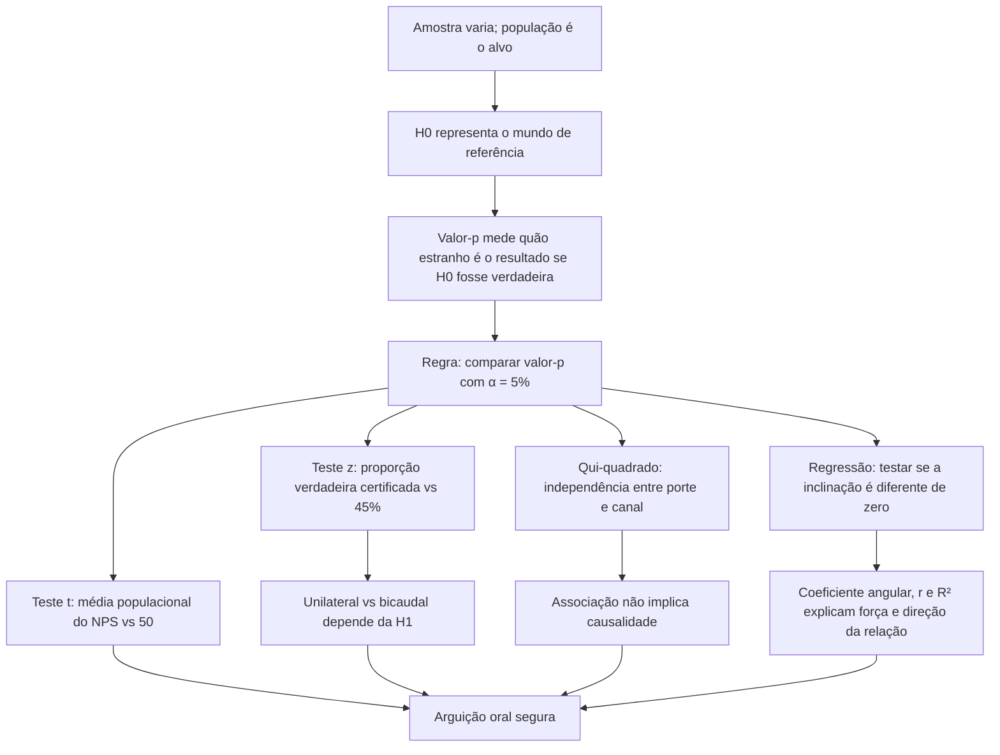

> [!quote] YOU

> [!note] SKILL loaded: teach

Quero que você seja meu professor particular de Estatística II e me prepare para a arguição oral da 1ª Atividade Monitorada da FGV. Assuma que eu sei pouco e ensine do zero, com linguagem simples, fórmulas em texto comum e exemplos de negócio.

CONTEXTO DA ATIVIDADE

O trabalho analisa uma base de 240 corretoras da Atlântica Seguros. O nível de significância usado é α = 5%.

As quatro análises são:

1. Teste t para uma média:
Verificar se o NPS médio da rede difere de 50.

2. Teste para uma proporção:
Verificar se a proporção de corretoras certificadas está abaixo da meta de 45%. Também preciso entender o que mudaria em um teste bicaudal.

3. Teste qui-quadrado de independência:
Verificar se o canal de atendimento — Digital, Híbrido ou Presencial — está associado ao porte da corretora — Pequena, Média ou Grande.

4. Regressão linear simples:
Explicar o NPS, variável Y, usando a taxa de renovação, variável X. Preciso entender a equação da reta, coeficiente angular, intercepto, teste t/F, valor-p, correlação e R².

RESULTADOS CORRETOS PARA VOCÊ USAR COMO GABARITO INTERNO

Análise 1:
- n = 240
- Média do NPS = 45,696
- Desvio-padrão = 18,743
- Erro-padrão = 1,210
- t = -3,558
- Graus de liberdade = 239
- Valor-p bicaudal = 0,00045
- IC 95% = 43,31 até 48,08
- Conclusão: rejeitar H0; o NPS médio difere de 50 e está abaixo do patamar de referência.

Análise 2:
- Certificadas = 106 de 240
- Proporção amostral = 44,17%
- z = -0,259
- Valor-p unilateral aproximado = 0,398
- Valor-p bicaudal aproximado = 0,795
- Conclusão: não rejeitar H0; apesar de 44,17% ser numericamente inferior a 45%, não existe evidência estatística suficiente de que a proporção verdadeira esteja abaixo da meta.

Análise 3:
Tabela observada:
- Grandes: 41 Digital, 24 Híbrido, 15 Presencial
- Médias: 22 Digital, 35 Híbrido, 23 Presencial
- Pequenas: 15 Digital, 15 Híbrido, 50 Presencial

Resultados:
- Qui-quadrado = 44,990
- Graus de liberdade = 4
- Valor-p ≈ 0,000000004
- V de Cramér = 0,306
- Conclusão: rejeitar H0; existe associação entre porte e canal.
- Padrão: grandes são mais digitais, médias mais híbridas e pequenas mais presenciais.

Análise 4:
- Equação: NPS previsto = -86,856 + 1,686 × taxa de renovação
- Correlação r = 0,854
- R² = 72,88%
- t do coeficiente angular = 25,289
- F = 639,528
- Graus de liberdade do F = 1 e 238
- Valor-p ≈ 2,22 × 10^-69
- Conclusão: a taxa de renovação tem relação linear positiva, forte e estatisticamente significativa com o NPS. Cada aumento de 1 ponto percentual na renovação está associado a aproximadamente 1,69 ponto adicional de NPS. Associação não prova causalidade.

> [!question] Quiz
> Antes de montar o plano, vou localizar seu ponto de partida. Em um teste de hipótese, o que o valor-p mede?
>
> 1. A chance de H0 ser verdadeira depois de ver a amostra
> 2. A chance de rejeitar H0 quando H0 é verdadeira
> 3. A chance de a média amostral ser igual à média populacional
> 4. A chance de observar um resultado tão extremo quanto o da amostra se H0 fosse verdadeira

> [!failure] Quiz — incorrect ✗
> Your answer: 2. A chance de rejeitar H0 quando H0 é verdadeira
> Correct answer: 4
>
> O valor-p é calculado assumindo H0 como verdadeira. Ele pergunta: “se H0 fosse verdade, quão raro seria ver uma estatística tão extrema quanto a observada?” Ele não é a probabilidade de H0 ser verdadeira. A chance de rejeitar H0 quando H0 é verdadeira é o nível de significância α, não o valor-p.

> [!question] Quiz
> Se α = 5% e o valor-p de um teste é 0,398, qual decisão estatística correta tomamos?
>
> 1. Rejeitar H0
> 2. Aumentar α automaticamente
> 3. Não rejeitar H0
> 4. Aceitar H1 como verdadeira

> [!success] Quiz — correct ✓
> Your answer: 3. Não rejeitar H0
> Correct answer: 3
>
> A regra operacional é: se valor-p ≤ α, rejeitamos H0; se valor-p > α, não rejeitamos H0. Como 0,398 é muito maior que 0,05, não rejeitamos H0. Isso não prova que H0 seja verdadeira; só diz que a amostra não trouxe evidência suficiente contra H0.

> [!question] Quiz
> No teste t para uma média, quando comparamos o NPS médio da amostra com 50, o que fica no centro da hipótese nula H0?
>
> 1. A média populacional do NPS é 50
> 2. O erro-padrão do NPS é 50
> 3. A média amostral do NPS é 50
> 4. O desvio-padrão amostral é 50

> [!failure] Quiz — incorrect ✗
> Your answer: 3. A média amostral do NPS é 50
> Correct answer: 1
>
> H0 fala sobre o parâmetro da população, não sobre o número observado na amostra. Aqui o parâmetro é a média verdadeira da rede, μ. A amostra deu média 45,696, mas o teste pergunta se essa diferença em relação a 50 é grande demais para ser explicada por variação amostral.

> [!question] Quiz
> Qual frase separa corretamente amostra e população no caso das 240 corretoras?
>
> 1. A amostra é sempre desconhecida; a população é sempre calculada exatamente
> 2. A amostra é o conjunto observado; a população é o alvo sobre o qual queremos concluir
> 3. A amostra e a população são sempre o mesmo conjunto
> 4. A amostra é o alvo completo; a população é o subconjunto observado

> [!success] Quiz — correct ✓
> Your answer: 2. A amostra é o conjunto observado; a população é o alvo sobre o qual queremos concluir
> Correct answer: 2
>
> A amostra é o que foi observado: aqui, as 240 corretoras da base. A população é o universo conceitual sobre o qual queremos inferir, como a rede/realidade verdadeira das corretoras da Atlântica Seguros. Testes estatísticos existem justamente porque usamos a amostra para tirar conclusões sobre parâmetros populacionais.

> [!question] Quiz
> Na análise das corretoras certificadas, “verificar se a proporção está abaixo da meta de 45%” pede qual hipótese alternativa?
>
> 1. p ≠ 0,45
> 2. p < 0,45
> 3. p = 0,4417
> 4. p > 0,45

> [!success] Quiz — correct ✓
> Your answer: 2. p < 0,45
> Correct answer: 2
>
> A palavra “abaixo” define uma alternativa unilateral à esquerda: H1: p < 0,45. Um teste bicaudal seria H1: p ≠ 0,45, isto é, interessado em qualquer diferença, tanto abaixo quanto acima da meta.

> [!question] Quiz
> Se o teste unilateral à esquerda da proporção deu z = -0,259 e valor-p ≈ 0,398, o que muda no teste bicaudal, mantendo a mesma amostra?
>
> 1. O valor-p fica aproximadamente 0,199
> 2. O z vira necessariamente positivo
> 3. O valor-p fica aproximadamente 0,795
> 4. A proporção amostral vira 45%

> [!failure] Quiz — incorrect ✗
> Your answer: 1. O valor-p fica aproximadamente 0,199
> Correct answer: 3
>
> Com z negativo, o teste unilateral à esquerda olha só a cauda esquerda: cerca de 0,398. O bicaudal olha desvios para os dois lados, então dobra a cauda extrema correspondente: aproximadamente 2 × 0,398 = 0,796, arredondado para 0,795. A amostra e o z observado não mudam; muda a pergunta feita pelo teste.

> [!question] Quiz
> No teste qui-quadrado de independência entre porte e canal, o que a hipótese nula H0 afirma?
>
> 1. Grandes corretoras usam mais o canal digital
> 2. Todos os canais têm a mesma frequência observada
> 3. Porte e canal têm médias iguais
> 4. Porte e canal não estão associados

> [!success] Quiz — correct ✓
> Your answer: 4. Porte e canal não estão associados
> Correct answer: 4
>
> No qui-quadrado de independência, H0 diz que as duas variáveis categóricas são independentes: conhecer o porte não muda a distribuição esperada do canal. H1 diz que existe associação: a distribuição de canais muda conforme o porte.

> [!question] Quiz
> Na tabela 3 × 3 de porte por canal, quais são os graus de liberdade do teste qui-quadrado de independência?
>
> 1. 6
> 2. 8
> 3. 4
> 4. 9

> [!success] Quiz — correct ✓
> Your answer: 3. 4
> Correct answer: 3
>
> Para uma tabela com r linhas e c colunas, os graus de liberdade são (r - 1)(c - 1). Aqui são 3 portes e 3 canais, então (3 - 1)(3 - 1) = 2 × 2 = 4.

> [!question] Quiz
> Na regressão NPS previsto = -86,856 + 1,686 × taxa de renovação, o que significa o coeficiente 1,686?
>
> 1. Cada 1 ponto percentual a mais na renovação se associa a 1,686 ponto a mais no NPS previsto
> 2. A regressão explica exatamente 1,686% da variação do NPS
> 3. A correlação entre renovação e NPS é 1,686
> 4. Quando a renovação sobe 1%, o NPS necessariamente sobe 86,856 pontos

> [!failure] Quiz — incorrect ✗
> Your answer: 3. A correlação entre renovação e NPS é 1,686
> Correct answer: 1
>
> O coeficiente angular diz quanto o Y previsto muda quando X aumenta uma unidade. Aqui, se a taxa de renovação está em pontos percentuais, +1 ponto percentual em renovação está associado a +1,686 ponto no NPS previsto. É associação estatística, não prova automática de causalidade.

> [!question] Quiz
> Se a correlação entre renovação e NPS é r = 0,854 e R² = 72,88%, qual interpretação está correta?
>
> 1. A regressão linear explica cerca de 72,88% da variação observada do NPS
> 2. O NPS aumenta 72,88 pontos quando a renovação aumenta 1 ponto
> 3. A correlação é fraca porque está abaixo de 1
> 4. A taxa de renovação causa exatamente 72,88% do NPS de cada corretora

> [!question] Quiz — I don't know
> Your answer: I don't know
> Correct answer: 1
>
> R² é a fração da variação de Y que é explicada pelo modelo linear com X. Aqui, o modelo com taxa de renovação explica cerca de 72,88% da variação observada do NPS. Isso não é causalidade individual, nem é o coeficiente angular. Como r = 0,854, a associação linear é forte e positiva.

> [!question] Question
> Para a arguição oral, você quer que eu prepare você em qual formato principal?
>
> 1. Explicação do zero + simulado de perguntas da banca (Recomendado)
> 2. Só explicação do zero
> 3. Só treino de arguição

> [!example] Answer
> 1. Explicação do zero + simulado de perguntas da banca (Recomendado)

> [!abstract] PI

Perfeito. Já mapeei seu ponto de partida:

- Você sabe aplicar a regra “valor-p < α rejeita H0”.
- Você distingue amostra e população quando perguntado diretamente.
- Você já pegou bem a ideia de hipótese unilateral “abaixo”.
- Você sabe a H0 do qui-quadrado de independência e os graus de liberdade da tabela 3×3.
- Seus pontos frágeis agora são:
  - o significado exato de valor-p;
  - diferença entre parâmetro populacional e estatística amostral dentro da H0;
  - diferença entre teste unilateral e bicaudal;
  - interpretação de coeficiente angular, correlação e R² na regressão.

Vou esperar uma checagem rápida de conteúdo para montar o plano da aula com segurança. Depois te apresento:

1. a ordem de estudo;
2. o mapa de dependências;
3. e só começo a ensinar quando você aprovar o plano.

> [!abstract] PI

Ótimo. Com base no seu diagnóstico, vou te preparar assim:

## Plano da preparação

Vamos começar pelo **motor comum dos testes estatísticos**: hipótese nula, hipótese alternativa, valor-p e decisão com α = 5%. Esse é o alicerce que sustenta as três primeiras análises e também aparece na regressão.

Depois vamos aplicar esse motor, em ordem:

1. **Teste t para média**  
   Entender por que a pergunta é sobre a média populacional do NPS, não só sobre a média da amostra.

2. **Teste z para proporção**  
   Entender por que “abaixo de 45%” é unilateral e o que muda se for bicaudal.

3. **Qui-quadrado de independência**  
   Entender associação entre duas variáveis categóricas: porte e canal.

4. **Regressão linear simples**  
   Entender reta, intercepto, coeficiente angular, teste da inclinação, correlação e R².

Depois disso fazemos o **simulado oral**, com perguntas prováveis da banca e respostas curtas.

## Mapa de dependências

A ideia é: primeiro você entende **o mecanismo geral de decisão estatística**; depois cada análise vira só uma aplicação diferente desse mesmo mecanismo.

Se esse plano estiver ok, eu começo pela primeira base: **o que são H0, H1, valor-p e α**, usando exemplos da Atlântica Seguros.

> [!quote] YOU

ok

> [!abstract] PI

Perfeito. Vamos construir do zero.

## Nó 1 — Amostra varia; população é o alvo

### 1. Motivo

A Atlântica tem uma base com **240 corretoras**. A pergunta da arguição não é só:

> “O que aconteceu nessas 240 corretoras?”

A pergunta estatística é mais ambiciosa:

> “O que esses dados sugerem sobre a realidade da rede da Atlântica?”

Essa diferença é o coração da estatística.

---

### 2. Verdade fundamental

**Amostra é o que eu observei. População é o alvo sobre o qual eu quero concluir.**

No seu trabalho:

- **Amostra:** as 240 corretoras analisadas.
- **População/alvo:** a rede ou realidade mais ampla das corretoras da Atlântica Seguros.

A média amostral do NPS foi:

> 45,696

Mas o teste não quer saber apenas se **essa amostra** deu 45,696. Isso já sabemos.

Ele quer saber:

> será que a **média verdadeira da rede** pode ser 50, e essa amostra só saiu um pouco abaixo por acaso?

---

### 3. Conexão

Essa distinção explica por que as hipóteses usam letras como:

- média populacional: μ
- proporção populacional: p
- inclinação populacional da regressão: β₁

E não apenas os números observados na amostra.

Exemplo:

No teste t, a hipótese nula é:

> H0: μ = 50

Não é:

> H0: média amostral = 50

Porque a média amostral já veio 45,696. O que está em dúvida é a **média verdadeira da população**.

Frase oral segura:

> “A amostra apresentou NPS médio de 45,696, mas o teste avalia se há evidência suficiente para concluir que a média populacional difere de 50.”

Agora vamos confirmar se esse primeiro nó ficou sólido.
